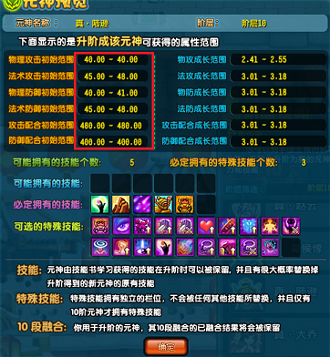
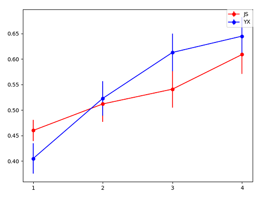

# 元神系统

## 属性点数

包括物理攻击点数、法术攻击点数、物理防御点数、法术防御点数、攻击配合点数、防御配合点数，如下图红框中所示。

属性点数由属性初始值、属性成长、元神等级和融合决定，计算公式为
$$属性点数=黄字点数+绿字点数$$
$$黄字点数=属性初始点数+每级增加点数*(等级-1)$$
$$绿字点数=手动分配点数+融合点数$$
其中，属性初始点数为元神本身决定的常数。在“阶层查询”面板可以看到升阶所得的元神的属性初始点数，如下图的红框所示。

而每级增加点数为分段函数
$$
每级增加点数 =
\begin{cases}
   \frac{1}{2}*属性成长^2 \qquad & 属性成长\leq5 \\
   12.5+2.5*(属性成长-5) \qquad & 属性成长>5
\end{cases}
$$
手动分配点数一般为
$$手动分配点数=5*(等级-1)$$
融合点数取决于融合材料元神的属性点数，见[融合](#融合)一节。

> 例：一个元神的物理攻击初始点数为45，物理攻击成长是紫修罗5.5，其到140级时，点数能有多少？
>
> 解：
> $$每级增加点数=12.5+2.5*(5.5-5)=13.75$$
> $$黄字点数=45+13.75*(140-1)=1956.25$$
> $$绿字点数=5*(140-1)+融合点数=695+融合点数$$

[元神属性计算器][元神属性计算器]是一个计算元神属性的小工具。

## 属性百分比

包括物理攻击百分比、法术攻击百分比、物理防御百分比、法术防御百分比、攻击配合百分比、防御配合百分比。

属性百分比与属性点数间存在直接的对应关系。

物理攻击、法术攻击、物理防御、法术防御的百分比与点数之间的关系相同，为
$$属性百分比=F(\lfloor 属性点数 \rfloor)+特技百分比提升$$
其中$\lfloor 属性点数 \rfloor$表示属性点数向下取整，特技百分比提升为猛击/咒术/坚守/庇护增加的属性百分比。函数$F(\lfloor 属性点数 \rfloor)$的表格与图像见[元神属性点数与属性百分比对应表](元神属性点数与属性百分比对应表.md)。

攻击配合、防御配合的百分比与点数之间的关系为
$$配合属性百分比=(\lfloor 属性点数 \rfloor /8 \quad 然后直接截断保留2位小数)$$
其中$\lfloor 属性点数 \rfloor$表示属性点数向下取整。

> 例：一个元神的攻击配合点数为489.69，对应的攻击配合百分比为多少？
>
> 解：
> $$\lfloor 攻击配合点数 \rfloor/8=489/8=61.125$$
> 故
> $$攻击配合百分比=61.12\%$$

[元神属性计算器][元神属性计算器]包含了属性百分比的计算。

## 属性成长

包括物理攻击成长、法术攻击成长、物理防御成长、法术防御成长、攻击配合成长、防御配合成长。

属性成长在不同范围内时有不同称号，见[元神属性成长称号与元神成长丸每周成功次数限制表](元神属性成长称号与元神成长丸每周成功次数限制表.md)。

物理攻击成长、法术攻击成长、物理防御成长、法术防御成长可通过元神成长丸、精制元神成长丸和高级元神成长丸来提升。每使用一个丸子有概率成功提升成长值。使用元神成长丸和精制元神成长丸（均简称小丸子）每成功一次提升0.01成长值，使用高级元神成长丸（简称大丸子）每成功一次提升0.02成长值。丸子的每周成功次数有限制，见[元神属性成长称号与元神成长丸每周成功次数限制表](元神属性成长称号与元神成长丸每周成功次数限制表.md)。

攻击配合成长和防御配合成长不能提升。要想改变，只能通过属性转移来实现。

## 融合

包括1段融合、2段融合、3段融合、4段融合、5段融合、6段融合、7段融合、8段融合、9段融合、10段融合。

融合的目的是提升对应属性的属性点数来获得更高的属性百分比。

每段融合都需要元神达到一定等级才能激活，未激活的融合段的点数不计入对应的元神属性点数中。1-10段融合的激活等级分别为10, 20, 30, 40, 50, 60, 70, 75, 80, 85。

融合材料元神有等级限制，某段融合的材料元神的最高等级为该段融合的激活等级减1，即1-10段融合的材料元神的最高等级为9, 19, 29, 39, 49, 59, 69, 74, 79, 84。

融合点数取决于主元神的幸运、魂器数量与材料元神的属性点数。当主元神的幸运已满且魂器数量达到100时，
$$融合点数=(材料元神属性点数-材料元神属性融合点数)/20$$
由上式可知，融合材料元神的融合点数不纳入融合点数的计算中。而由[属性点数](#属性点数)一节可知，
$$材料元神属性点数-材料元神属性融合点数=属性初始点数+每级增加点数*(等级-1)+手动分配点数$$

[元神属性计算器][元神属性计算器]包含了融合点数的计算。

融合时，融合材料元神需与主元神的四象一致。洗元神四象的道具为商城中的四象宝玉（50三国点一个）。

## 幸运

元神幸运只影响元神融合，见[融合](#融合)一节。

## 忠诚

**忠诚百分比**与**忠诚**间存在直接的对应关系，见[元神忠诚与忠诚百分比对应表](元神忠诚与忠诚百分比对应表.md)。

忠诚百分比影响属性百分比的实际效果，关系为
$$元神属性加成=元神属性百分比*元神忠诚百分比$$
具体见[伤害计算](伤害计算.md)。

## 等级

元神经验的数值设定表与角色经验相同，见[这里](角色经验表.md)。

元神单位经验是元神经验计算中的参数，只与元神等级有关，其具体作用见后文。元神单位经验的数值设定表可参考原始解包数据表[元神单位经验数据][元神单位经验数据]。

元神经验道具的经验为
$$道具经验=单位经验*经验倍数$$
其中经验倍数为元神经验道具给定的常数。僵尸大白菜的经验倍数为10，翡翠白菜的经验倍数为100。

> 例：110级0经验的元神升级到111级需要吃多少个僵尸大白菜？
>
> 解：查表知，110级升到111级所需经验为39220192928，110级时元神单位经验为9378161，则所需僵尸大白菜数量为
> $$\frac{39220192928}{9378161*10}=418.21$$

## 四象

四象

## 技能

### 反击类技能

元神反击类技能包括雪恨低级、雪恨高级、青龙摆尾(仿)、青龙摆尾、真青龙摆尾等。

反击类技能的触发概率、反击忽略护甲百分比见[这里](元神反击类技能数据表.md)。

### 乱舞类技能

元神乱舞类技能包括乱舞低级、蛇矛乱舞、真蛇矛乱舞、万箭齐发、真万箭齐发、围剿低级、祭魂低级、尖啸低级等。

攻击单体目标时，乱舞类技能的触发概率见[这里](元神乱舞类技能数据表.md)。攻击多个目标时，设目标数为$n$，则$P(触发k次乱舞类技能), k=1, 2, ..., n$并不是独立地对每个目标依次判定触发所得的概率，而可能是人为设定的值，并且设定的概率可能跟职业有关，如[2022-1-19全服更新](https://sg.qq.com/webplat/info/news_version3/159/24483/24484/24485/m17776/202201/908368.shtml)对万箭的触发概率进行了调整：“近战职业使用万箭齐发时，触发概率会有一定衰减。”该更新后，$P(攻击n个目标触发万箭)=\sum_{k=1}^n P(触发k次万箭)$的实测数据见下图（其中横坐标为目标数，纵坐标为万箭触发概率）：

## 特技

各个元神特技的各级效果见[这里](元神特技效果表.md)。

健壮特技的角色生命上限提升量与元神等级有关，可参考原始解包数据表[元神健壮特技生命上限提升数据][元神健壮特技生命上限提升数据]。

元神特技升级所需精粹数量可参考原始解包数据表[元神特技升级数据][元神特技升级数据]。

## 升阶

元神升阶

## 属性转移

元神属性转移

## TODO

* 元神属性点数与属性百分比对应表的完善
* 丸子的成功概率
* 元神的打怪经验的计算
* 大乔春风的群攻触发规则

[元神属性计算器]: http://124.222.71.158/apps/实用计算器/元神属性计算器
[元神单位经验数据]: https://view.officeapps.live.com/op/view.aspx?src=https://cloud.tsinghua.edu.cn/f/bb125c54f1f54224965d/?dl=1
[元神健壮特技生命上限提升数据]: https://view.officeapps.live.com/op/view.aspx?src=https://cloud.tsinghua.edu.cn/f/8ea783ec407746ee9465/?dl=1
[元神特技升级数据]: https://view.officeapps.live.com/op/view.aspx?src=https://cloud.tsinghua.edu.cn/f/c9f2bfd1382e41409b74/?dl=1
