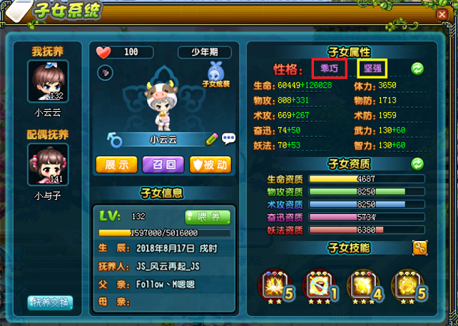
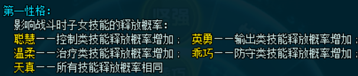
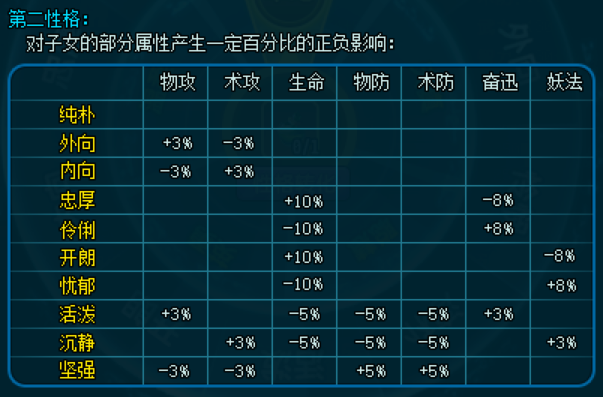

# 子女系统

## 属性

子女属性包括生命、体力、物攻、物防、术攻、术防、奋迅、武力、妖法、智力。

子女生命、物攻、术攻、奋迅、妖法的计算公式为
$$属性=(黄字属性+绿字属性)*性格加成$$
$$黄字属性=初始值+职业成长$$
$$绿字属性=资质成长$$
其中初始值由子女出生时的值加上天命石的提升而得。职业成长的取值可参考原始解包数据表[子女职业成长属性数据][子女职业成长属性数据]。资质成长的计算公式为
$$生命资质成长=生命资质成长常数*等级*(生命资质/10000)$$
$$奋迅资质成长=奋迅资质成长常数*等级*(奋迅资质/10000)$$
$$妖法资质成长=妖法资质成长常数*等级*(妖法资质/10000)$$
其中资质成长常数的取值见下表：

| 子女职业 | 生命资质成长常数 | 奋迅资质成长常数 | 妖法资质成长常数 |
| ---- | ---- | ---- | ---- |
| YX | 1796.29 | 0.68 | 0.65 |
| HJ | 2037.03 | 0.66 | 0.62 |
| XS | 1574.07 | 0.59 | 0.66 |

子女武力、智力的计算公式为
$$属性=黄字属性+绿字属性$$
$$黄字属性=职业成长$$
$$绿字属性=资质成长$$
其中职业成长的取值可参考原始解包数据表[子女职业成长属性数据][子女职业成长属性数据]。

子女物防、法防的计算公式为
$$属性=黄字属性*性格加成$$
$$黄字属性=职业成长$$
其中职业成长的取值可参考原始解包数据表[子女职业成长属性数据][子女职业成长属性数据]。

子女体力的计算公式为
$$属性=黄字属性$$
$$黄字属性=职业成长$$
其中职业成长的取值可参考原始解包数据表[子女职业成长属性数据][子女职业成长属性数据]。

## 性格

子女性格分为第一性格（如下图的红框所示）和第二性格（如下图的黄框所示）。

子女第一性格影响战斗时子女主动技能的释放概率，如下图所示。

一般来说，释放概率得到第一性格增加的主动技能会在CD结束后马上释放，而释放概率没有得到增加的技能在CD结束后不一定马上释放，可能会在CD结束数秒后才释放。比如，要想实现子女无限盾效果，乖巧性格是必需的，否则子女盾的CD结束后不一定马上释放，就可能会导致子女盾中断。

子女第二性格对子女的部分属性产生一定百分比的正负影响，见下图与[属性](#属性)一节。

## 资质

子女资质影响子女属性的资质成长值大小，见[属性](#属性)一节。

资质可通过培养来提升，培养资质的过程称为资质随机或洗髓。每个启蒙期或少年期的子女都有一个洗髓范围，如下图的红框所示。

洗髓时，五项资质会进行随机，随机得到的新资质的总和会落在上述的洗髓范围内。

洗髓范围的上限为50000，而下限会随着洗髓次数的增加而升高，其具体关系见下表。

| 洗髓范围 | 达到该范围所需总洗髓次数 | 该范围提升到下一范围所需洗髓次数 |
| :----: | :----: | :----: |
| 8000~50000 | 0 | 10 |
| 10000~50000 | 10 | 10 |
| 12000~50000 | 20 | 20 |
| 14000~50000 | 40 | 20 |
| 16000~50000 | 60 | 20 |
| 18000~50000 | 80 | 20 |
| 20000~50000 | 100 | 20 |
| 22000~50000 | 120 | 30 |
| 24000~50000 | 150 | 30 |
| 26000~50000 | 180 | 30 |
| 28000~50000 | 210 | 30 |
| 30000~50000 | 240 | 30 |
| 32000~50000 | 270 | 30 |
| 34000~50000 | 300 | 30 |
| 36000~50000 | 330 | 30 |
| 38000~50000 | 360 | 40 |
| 40000~50000 | 400 | 50 |
| 42000~50000 | 450 | 50 |
| 44000~50000 | 500 | 50 |
| 46000~50000 | 550 | 50 |
| 48000~50000 | 600 | 无法再提升 |

每次洗髓消耗300000三国币和1个洗髓丹。

## 等级

子女经验和子女单位经验的数值设定可参考原始解包数据表[子女经验数据][子女经验数据]。子女单位经验是元神经验计算中的参数，只与子女等级有关，其具体作用见后文。

子女经验只能通过使用子女经验道具来提升。每天最多使用10个子女经验道具，儿童节活动时每天最多使用20个。

子女经验道具的经验为
$$道具经验=单位经验*经验倍数$$
其中经验倍数为子女经验道具给定的常数。子女经验道具的经验倍数与适用等级见下表。

| 道具 | 经验倍数 | 适用等级 |
| :----: | :----: | :---- |
| 彩虹糖 | 10 | 襁褓期、启蒙期和少年期（所有等级） |
| 棉花糖 | 20 | 启蒙期和少年期（15级及以上） |
| 波板糖 | 40 | 少年期（45级及以上） |
| 甜甜圈 | 60 | 少年期（45级及以上） |
| 儿童蛋糕 | 100 | 30级及以上 |

> 例：130级0经验的子女升级到131级需要吃多少个棉花糖？需要吃几天？
>
> 解：查表知，130级升到131级所需经验为4160000，130级时子女单位经验为1300，则所需棉花糖数量为
> $$\frac{4160000}{1300*20}=160$$
> 每天最多吃10个，所以需要吃16天（儿童节活动时每天最多吃20个，需要吃8天）。

## 心情

子女心情影响子女释放技能的概率，可通过喂养以及和子女互动提升心情。

## 技能

### 技能孔位

子女技能孔位共分4行，每行有1个主动技能孔位和3个被动技能孔位，共16个孔位，如下图所示。

每个孔位都需要子女达到一定等级才能开启。每行的主动技能孔位在子女达到相应等级开启后，该行尚未达到开启等级的被动技能孔位可通过消耗洗孔石和三国币提前开启。提前开启后，若子女降级导致某行的主动技能孔位关闭，子女重新达到该行主动技能孔位的开启等级后，该行尚未达到开启等级的被动技能孔位需重新通过消耗洗孔石和三国币才能提前开启。

上图给出了技能孔位的编号。根据编号，各孔位的开启等级和提前开启消耗可参考原始解包数据表[子女技能孔位数据][子女技能孔位数据]。

### 主动技能

子女主动技能分为攻击技能、防守技能、治疗技能和控制技能四类。第1、2行的主动技能孔位只能放置攻击技能或控制技能，第3、4行的主动技能孔位只能放置防守技能或治疗技能。子女主动技能的冷却时间、蓄气时间、伤害系数、效果描述等见[这里](子女主动技能数据表.md)。不同职业的子女可学习的主动技能不同，见[这里](不同职业子女可学习的主动技能表.md)。

主动技能各等级对应的经验见下表。

| 技能星级 | 技能等级 | 该等级0%对应经验 | 该等级100%对应经验 |
| :----: | :----: | :----: | :----: |
| 一星 | 1 | 1 | 16 |
| 一星 | 2 | 17 | 48 |
| 一星 | 3 | 49 | 108 |
| 一星 | 4 | 109 | 228 |
| 一星 | 5 | 229 | 229 |
| 二星 | 1 | 1 | 29 |
| 二星 | 2 | 30 | 87 |
| 二星 | 3 | 88 | 196 |
| 二星 | 4 | 197 | 415 |
| 二星 | 5 | 416 | 416 |
| 三星 | 1 | 1 | 29 |
| 三星 | 2 | 30 | 87 |
| 三星 | 3 | 88 | 196 |
| 三星 | 4 | 197 | 415 |
| 三星 | 5 | 416 | 416 |

每吃一本主动技能书，对应技能的经验随机增加8、9、10或11，且取这4个值的概率**似乎**是相等的，**这样的话**平均每本增加9.5经验。由此可计算主动技能升级所需的技能书数量。

> 例：三星主动技能从零升到4级平均需要几本技能书？
>
> 解：查表知，三星技能升到4级所需经验为197，则所需技能书数量的平均值为
> $$\frac{197}{9.5}=20.7$$

### 被动技能

子女被动技能的描述见[这里](子女被动技能数据表.md)。不同职业的子女可学习的被动技能不同，且不同的被动技能开放学习的等级和可搭配的主动技能类别不同，见[这里](不同职业子女可学习的被动技能与被动技能开放学习等级表.md)。

子女达到被动技能的开放学习等级后，需到书院开课才能开始学习。被动技能开课成本见下表。

| 技能星级 | 开课消耗童子技击术数量 | 开课消耗三国币（万） |
| :----: | :----: | :----: |
| 一星 | 0 | 0 |
| 二星 | 6 | 500 |
| 三星 | 20 | 1000 |

被动技能等级$<5$级时，其上课学习称为普通学习或学习，被动技能等级$\geq 5$级时，其上课学习称为深度学习。

深度学习的开启需要条件。未开启深度学习时，被动技能等级达到5级后不能再继续上课。一星技能深度学习的开启条件为子女有3个一星技能达到5级，二星技能深度学习的开启条件为子女有4个二星技能达到5级，三星技能深度学习的开启条件为子女有5个三星技能达到5级。

每周的上课次数有限制。每周的普通学习次数最多为10次（儿童节活动时最多为20次），深度学习次数最多为20次。

普通学习一节课增加300经验，深度学习一节课增加600经验。每节课有一定概率开小差或收获满满，开小差时获得经验减半，收获满满时获得经验翻倍。

被动技能各等级对应的经验见下表。

| 技能星级 | 技能等级 | 该等级0%对应经验 | 该等级100%对应经验 |
| :----: | :----: | :----: | :----: |
| 一星 | 0 | 0 | 299 |
| 一星 | 1 | 300 | 689 |
| 一星 | 2 | 690 | 1199 |
| 一星 | 3 | 1200 | 1859 |
| 一星 | 4 | 1860 | 2699 |
| 一星 | 5 | 2700 | 3739 |
| 一星 | 6 | 3740 | 5049 |
| 一星 | 7 | 5050 | 6679 |
| 一星 | 8 | 6680 | 8859 |
| 一星 | 9 | 8860 | 11699 |
| 一星 | 10 | 11700 | 11700 |
| 二星 | 0 | 0 | 299 |
| 二星 | 1 | 300 | 699 |
| 二星 | 2 | 700 | 1229 |
| 二星 | 3 | 1230 | 1959 |
| 二星 | 4 | 1960 | 2999 |
| 二星 | 5 | 3000 | 4499 |
| 二星 | 6 | 4500 | 6449 |
| 二星 | 7 | 6450 | 8999 |
| 二星 | 8 | 9000 | 12299 |
| 二星 | 9 | 12300 | 16799 |
| 二星 | 10 | 16800 | 16800 |
| 三星 | 0 | 0 | 599 |
| 三星 | 1 | 600 | 1399 |
| 三星 | 2 | 1400 | 2599 |
| 三星 | 3 | 2600 | 4099 |
| 三星 | 4 | 4100 | 5999 |
| 三星 | 5 | 6000 | 8409 |
| 三星 | 6 | 8410 | 11779 |
| 三星 | 7 | 11780 | 16509 |
| 三星 | 8 | 16510 | 23129 |
| 三星 | 9 | 23130 | 32989 |
| 三星 | 10 | 32990 | 32990 |

被动技能上课成本见下表（三国币消耗中的括号内数值为在非自己家园所在小区上课的三国币消耗）。

| 技能星级 | 消耗道具名称 | 每节课消耗道具数量 | 每节课消耗三国币（万） |
| :----: | :----: | :----: | :----: |
| 一星 | 香墨 | 1 | 57(60) |
| 一星深度 | 香墨 | 3 | 57(60) |
| 二星 | 香墨 | 3 | 95(100) |
| 二星深度 | 精制香墨 | 2 | 95(100) |
| 三星 | 精制香墨 | 3 | 190(200) |
| 三星深度 | 精制香墨 | 7 | 190(200) |

> 例：设当前精制香墨的市场价为330万，童子技击术的市场价为185万，一个三星被动技能从未开课到5级的成本是多少？
>
> 解：开课成本为
> $$开课成本=185*20+1000 \  万=4700 \  万$$
> 查表知，三星被动技能升到5级所需经验为6000。被动技能等级$<5$级时，其上课学习为普通学习。普通学习一节课增加300经验，因此若不考虑开小差和收获满满，升到5级需要上20节课，上课成本为（在自己家园所在的小区上课）
> $$上课成本=(330*3+190)*20 \  万=23600 \  万$$
> 故总成本为
> $$总成本=开课成本+上课成本=2.83 \  亿$$

任意被动技能升到2、4、6、8、10级时，子女都可以获得一朵小红花。设子女共学习了$n$个被动技能，等级分别为$L_i, i=1, 2, ..., n$，则子女的小红花总数为
$$小红花总数=\sum_{i=1}^{n} \lfloor \frac{L_i}{2} \rfloor$$
其中$\lfloor\cdot\rfloor$表示向下取整。该值即为下图红框所示在书院看到的小红花总数。

领取的小红花用于在书院兑换物品，见下图。

[子女职业成长属性数据]: https://view.officeapps.live.com/op/view.aspx?src=https://cloud.tsinghua.edu.cn/f/26d0caba630e4faf818d/?dl=1
[子女经验数据]: https://view.officeapps.live.com/op/view.aspx?src=https://cloud.tsinghua.edu.cn/f/828850b18ca2446fb4eb/?dl=1
[子女技能孔位数据]: https://view.officeapps.live.com/op/view.aspx?src=https://cloud.tsinghua.edu.cn/f/3ebab600984047c0833e/?dl=1
